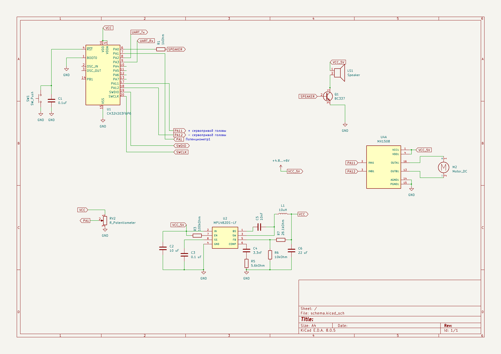

## Общие сведения

### 1. Цель проекта
   Разработать функционирующую модель "Скибиди туалета" для увеселения людей.
### 2. Команда исполнителей
   Козодой, Михайлов, Щетинин, Тахватулин

## Технические требования

### 1. Требования к функциональным характеристикам
 - Возможность передвигаться по поверхности
 - Воспроизведение звуковых материалов, связанных со скибиди туалетами
 - Возможность качать головой в разные стороны
### 2. Требования к надежности
 - *отсутствуют*
### 3. Условия эксплуатации
 - Не использовать модель в разрушительных для нее условиях (под водой, вблизи огня)
 - Не подвергать модель разрушительному воздействию гравитации (не ронять)
### 4. Требования к составу и параметрам технических средств
 - Питание изделия должно осуществляться от 2 батареек типа AA (2,4 - 3 вольта).
 - Микроконтроллер должен обладать достаточной производительностью и обладать периферией для загрузки аудио с flash памяти, подачи сигнала на динамик, управлением моторчиками.
 - Flash память должна вмещать трек не менее 4 секунд с битрейтом 8 и частотой дискретизации 44100 Гц.
### 5. Требования к информационной и программной совместимости
 - Программная часть изделия должна быть разработана с помощью языков программирования ASM/C.

## Требования к документации

Должны быть написаны:
 - Инструкция по эксплуатации изделия
 - Документация к программной части (или читаемый код)
 - Схема аппаратной части

## Технико-экономические показатели

 - [Flash-память для 20 (двадцати) секундного трека](https://www.chipdip.ru/product/w25q32jvssiq) - 54 рубля
 - [Микроконтроллер с поддержкой SPI, UART и ШИМ](https://www.chipdip.ru/product0/8016772393) - 47 рублей
 - [Динамик](https://www.chipdip.ru/product0/8031024898) - 18 рублей
 - [Сервопривод x2](https://aliexpress.ru/item/1005003791712510.html?sku_id=12000027178353864) - 67 рублей
 - [Моторчик](https://www.chipdip.ru/product0/8008724455) - 120 рублей
 - [Н-мост](https://roboshop.spb.ru/modules/drajvery/drajvery-dvigatelej/mx1508-module) - 60 рублей
 - [Колеса для передвижения x4](https://aliexpress.ru/item/1005003696169461.html?spm=a2g2w.orderdetail.0.0.484b4aa6AZ4Sqs&sku_id=12000026935466137) - 32 рубля
 - [Оси для колес x2](https://aliexpress.ru/item/1005003732651852.html?spm=a2g2w.orderdetail.0.0.3c7d4aa6XIJFzk&sku_id=12000026970875203) - 16 рублей
 - [Программатор WCH-Link](https://www.chipdip.ru/product0/8033729310) - 470 рублей

## Cтадии и этапы разработки

1. Определение функциональных требований к изделию. &check;
2. Определение методов достижения поставленных требований. &check;
  * Генерация и отбраковка идей. &check;
  * Выбор подходящих комплектующих. &check;
3. Разработка электротехнической схемы изделия. &check;
4. Разработка 3d моделей изделия и компонентов (шестерёнки, etc.)
5. Разработка программной части.
6. Сборка изделия и прошивка.
7. Тестирование.
8. Устранение неполадок, обнаруженных при тестировании.

## Порядок контроля и приемки

Испытания отсутствуют. Единственный критерий выполнения ТЗ - выполнение всех изложенных требований

## Ссылки на источники

1. ГОСТ 19.201-78 Техническое задание. Требования к содержанию и оформлению
2. [CH32V203F6P6 Datasheets](https://www.wch-ic.com/downloads/CH32V203DS0_PDF.html).
3. [W25Q32JV Datasheet](https://static.chipdip.ru/lib/306/DOC029306111.pdf).

## Архитектура

## Аппаратная часть (схемотехника)

## Программная часть
